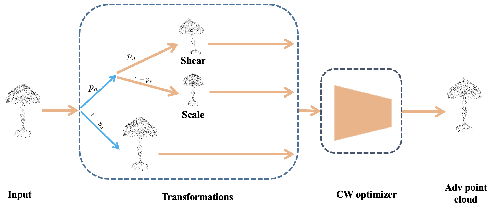

# SS-attack
official Pytorch implementation of paper 'Improving transferability of 3D adversarial attacks with scale and shear transformations', Information Sciences, 2024



### Introduction
As deep learning models become increasingly integral to various 3D applications, concerns about their vulnerability to adversarial attacks grow in tandem. This paper addresses the challenge of enhancing the transferability of 3D adversarial attacks, a critical aspect for evaluating model robustness across diverse scenarios. We propose a novel approach leveraging scale and shear transformations to generate adversarial examples that exhibit improved transferability across multiple 3D models.
Our methodology involves carefully integrating scale and shear transformations into the adversarial perturbation generation process with only a marginal increase in computational time. 
The proposed attack method operates within the Carlini-Wagner (CW) optimization framework. For each iteration, it employs two hyperparameters: p_{a}p_{a}, determining the probability of transforming the input point cloud, and 
p_{s}p_{s}, deciding whether to shear or scale the point cloud. Limited to scaling and shearing transformations, Scale and Shear (SS) attack seamlessly integrates with established attack methods, enhancing flexibility and compatibility in adversarial attacks on 3D models. Extensive experiments show that the SS attack proposed in this paper can be seamlessly combined with the existing state-of-the-art (SOTA) 3D point cloud attack methods to form more powerful attack methods, and the SS attack improves the transferability over 3.6 times compared to the baseline. Moreover, while substantially outperforming the baseline methods, the SS attack achieves SOTA transferability under various defenses. 

### Citation
if you find our work useful in your research, please consider citing:
```
@article{zhang2024improving,
  title={Improving transferability of 3D adversarial attacks with scale and shear transformations},
  author={Zhang, Jinlai and Dong, Yinpeng and Zhu, Jun and Zhu, Jihong and Kuang, Minchi and Yuan, Xiaming},
  journal={Information Sciences},
  volume={662},
  pages={120245},
  year={2024},
  publisher={Elsevier}
}
```

### How to use

#### Dataset
- we use aligned modelnet40 dataset to test the untargeted attack: https://shapenet.cs.stanford.edu/media/modelnet40_normal_resampled.zip

- download and unzip as baselines/official_data/modelnet40_normal_resampled

 ##### our pretrained model weights for aligned modelnet40 dataset:
 - without data augmentation:https://drive.google.com/file/d/1UP0Io60MSZjq2VqaJpLeJiyD6zeELJtz/view?usp=sharing

 - with data augmentation:https://drive.google.com/file/d/1AEWorvStis4GkfOfk2psKDiDK2xcOsLR/view?usp=sharing

 we use data and pretrained models of IF-Defense for targeted attack.

#### Attack
```
cd baselines
```
For untargeted ss-aof attack:
```
NCCL_DEBUG=INFO CUDA_VISIBLE_DEVICES=0,1,2,3,4 python -m torch.distributed.launch --nproc_per_node=5 --master_port=29502 attack_scripts/untargeted_ssaof_attack.py --process_data --model=pointnet --batch_size=128
```

For untargeted ss-advpc attack:
```
NCCL_DEBUG=INFO CUDA_VISIBLE_DEVICES=0,1,2,3,4 python -m torch.distributed.launch --nproc_per_node=5 --master_port=29502 attack_scripts/untargeted_ssadvpc_attack.py --process_data --model=pointnet --batch_size=32
```

#### Evaluate
Merge and inference generated adversarial examples:
```
CUDA_VISIBLE_DEVICES=0 python inference.py --data_root=attack/results/mn40_1024/AdvPC --prefix=UAdvPC-pointnet-0.18-GAMMA_0.25 --model=pointconv
```

### License
Our code is released under MIT License.

## Acknowledgements

We thank the authors of following works for opening source their excellent codes.

- [PointNet/PointNet++](https://github.com/yanx27/Pointnet_Pointnet2_pytorch), [DGCNN](https://github.com/WangYueFt/dgcnn), [PointConv](https://github.com/DylanWusee/pointconv_pytorch), [RS-CNN](https://github.com/Yochengliu/Relation-Shape-CNN)
- [Perturb/Add attack](https://github.com/xiangchong1/3d-adv-pc), [kNN attack](https://github.com/jinyier/ai_pointnet_attack), [Drop attack](https://github.com/tianzheng4/PointCloud-Saliency-Maps)
- [PU-Net](https://github.com/lyqun/PU-Net_pytorch), [DUP-Net](https://github.com/RyanHangZhou/DUP-Net)
- [ONet](https://github.com/autonomousvision/occupancy_networks), [ConvONet](https://github.com/autonomousvision/convolutional_occupancy_networks)
- [IF-Defense](https://github.com/Wuziyi616/IF-Defense)
- [AOF-Attack](https://github.com/code-roamer/AOF)

We also thank the authors of related papers/repos for their inspiring discussions with us.


